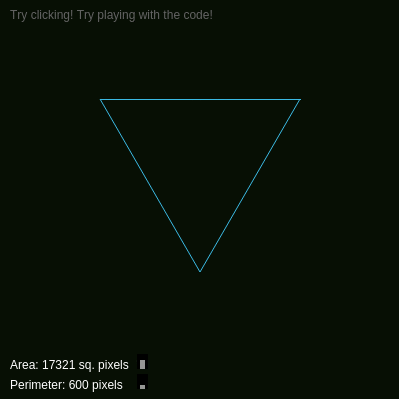

Koch Snowflake
==============

Interactive Koch Snowflake fractal generator in processing.js.

An infinite perimeter within a finite area!

Can be used to accompany [this](https://www.khanacademy.org/math/geometry/basic-geometry/koch_snowflake/v/koch-snowflake-fractal)
Khan Academy lesson video.

You can play with the interactive version
[here](https://www.khanacademy.org/computer-programming/koch-snowflake-area-and-perimeter-visualization/6654337503461376).

Or you can look at the gif.  It's not interactive, but it's kinder to your CPU.

`: )`
